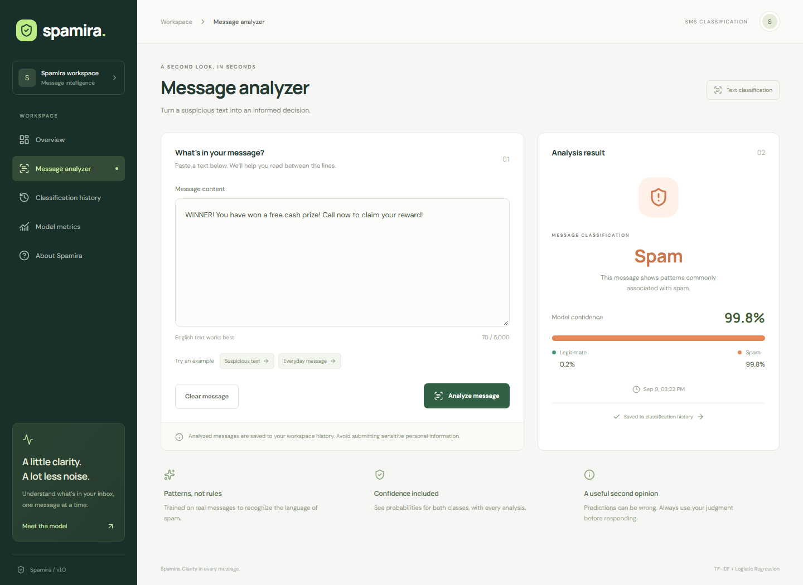

# Spamira

**Less spam. More clarity.**

Machine learning-powered web application for real-time spam detection and text message classification.

Spamira turns a text message into a clear classification, a confidence score, and a probability breakdown. A shared dashboard brings classification history and measured model performance into one workspace.



## Features

- **Message analyzer:** spam or legitimate results with both class probabilities, confidence, and timestamp.
- **Workspace overview:** persisted message totals, spam rate, recent activity, and model availability.
- **Classification history:** full message expansion, search, label filtering, pagination, and date sorting.
- **Transparent model metrics:** accuracy, precision, recall, F1-score, confusion matrix, and training metadata.
- **Reproducible training:** verified public dataset, deduplication before a stratified split, saved sklearn pipeline.
- **Responsive interface:** desktop sidebar, mobile navigation, accessible forms, loading, empty, and error states.
- **Operational foundations:** PostgreSQL persistence, EF Core migrations, safe errors, health checks, tests, and Docker Compose.

## Architecture

```text
React + TypeScript
        │
        ▼
ASP.NET Core API ────── PostgreSQL
        │                  EF Core
        ▼
Python FastAPI
        │
        ▼
TF-IDF + Logistic Regression
```

| Layer | Technology |
| --- | --- |
| Frontend | React 19, TypeScript, Vite 7, React Router, Lucide, Zod |
| Backend | ASP.NET Core 10, OpenAPI / Swagger, HttpClientFactory |
| Persistence | PostgreSQL 17, Entity Framework Core 10 |
| ML service | Python 3.14, FastAPI, scikit-learn, pandas, joblib |
| Infrastructure | Docker Compose, Nginx |
| Tests | xUnit, pytest, Vitest, Testing Library, Playwright |

## Quick start with Docker

Install Docker Engine with Compose, or Docker Desktop with the WSL 2 backend on Windows. Start Docker before continuing.

1. Clone the repository and enter its root directory.
2. Copy `.env.example` to `.env` (`cp .env.example .env`, or `Copy-Item .env.example .env` in PowerShell).
3. Set `POSTGRES_PASSWORD` to a unique, nonempty password. Use letters and digits to avoid connection-string and Compose interpolation delimiters.
4. Start all services:

```sh
docker compose up --build --wait
```

The first build downloads Python/Node/.NET dependencies and the UCI dataset, trains the model, creates the database, and applies EF Core migrations. Internet access is needed for the first build. Subsequent starts reuse images and the database volume.

| Service | Default address |
| --- | --- |
| Spamira | [localhost:3000](http://localhost:3000) |
| API Swagger | [localhost:5080/swagger](http://localhost:5080/swagger) |
| API health | [localhost:5080/health](http://localhost:5080/health) |
| Internal ML docs | [localhost:8000/docs](http://localhost:8000/docs) |

```sh
docker compose logs -f
docker compose down
```

`down` preserves history. `docker compose down -v` deletes the database volume and all stored classifications.

## Local development

Prerequisites: Node.js 24+, Python 3.14, .NET SDK 10, and PostgreSQL 17. The repository pins the .NET major version, direct package versions, Python dependency lock, and npm lockfile. The frontend uses Rollup's WebAssembly build for portable bundling.

### 1. Database

Start PostgreSQL locally, create a `spamira` database and a dedicated database user, or run only the database container after configuring `.env`:

```sh
docker compose up -d postgres
```

### 2. Train and start the ML service

From the repository root:

```sh
python -m venv .venv
# Linux/macOS:
source .venv/bin/activate
# Windows PowerShell instead:
# .\.venv\Scripts\Activate.ps1
pip install -r ml-service/requirements.lock
cd ml-service
python -m training.download_data
python -m training.train
python -m uvicorn app.main:app --host 127.0.0.1 --port 8000
```

If activation is restricted on Windows, call `.venv\Scripts\python.exe` directly instead of changing execution policy.

The downloader verifies the dataset checksum. If downloading is unavailable, obtain `SMSSpamCollection` from the [UCI dataset page](https://archive.ics.uci.edu/dataset/228/sms+spam+collection), place it at `data/raw/SMSSpamCollection`, and run the training command. The file must use `ham<TAB>message` or `spam<TAB>message` rows.

Training creates `ml-service/models/spam_classifier.joblib` and `metrics.json`. These artifacts and the raw dataset are excluded from Git. Train before starting the ML service; missing artifacts make readiness fail with `503`.

### 3. Start the API

In another terminal, from the repository root, configure the connection to your database. The API reads environment variables; it does not automatically load the Compose `.env` file.

PowerShell:

```powershell
$env:ConnectionStrings__Default = 'Host=localhost;Port=5432;Database=spamira;Username=spamira;Password=<your-password>;Timeout=5;Command Timeout=10'
$env:MlService__BaseUrl = 'http://localhost:8000'
$env:Database__AutoMigrate = 'true'
$env:ASPNETCORE_URLS = 'http://localhost:5080'
dotnet run --project backend/Spamira.Api
```

Linux/macOS:

```sh
export ConnectionStrings__Default='Host=localhost;Port=5432;Database=spamira;Username=spamira;Password=<your-password>;Timeout=5;Command Timeout=10'
export MlService__BaseUrl=http://localhost:8000
export Database__AutoMigrate=true
export ASPNETCORE_URLS=http://localhost:5080
dotnet run --project backend/Spamira.Api
```

For explicit migration management:

```sh
dotnet tool restore
dotnet ef database update --project backend/Spamira.Api
```

Keep the connection-string environment variable set. Set `Database__AutoMigrate=false` when applying migrations separately.

### 4. Start the frontend

```sh
cd frontend
npm ci
npm run dev
```

Open [localhost:5173](http://localhost:5173). Vite proxies `/api` to port 5080. To change it, set `API_PROXY_TARGET` in `frontend/.env.local`. `VITE_API_BASE_URL` defaults to `/api` and is compiled into production assets.

## Model performance

The reference training run produced:

| Accuracy | Precision | Recall | F1-score |
| ---: | ---: | ---: | ---: |
| 98.55% | 93.80% | 94.53% | 94.16% |

These measurements use 1,032 held-out SMS messages after removing duplicate normalized text. Spam is the positive class. The model combines word unigram/bigram TF-IDF with class-balanced Logistic Regression and returns `predict_proba` estimates. The UI always reads metrics from the loaded model.

See the [model card](docs/model-card.md) for preprocessing, split details, confusion matrix, and limitations. Retrain with `python -m training.train` from `ml-service`, then restart the ML service. To retrain Docker images from the current training code, rebuild the ML service with `docker compose build --no-cache ml-service` and run `docker compose up -d --wait`.

## Verification

```sh
# Frontend build and component/service tests
cd frontend
npm ci
npm run build
npm test
cd ..

# API build and integration tests
dotnet test backend/Spamira.slnx --configuration Release

# ML tests (activate the virtual environment and train first)
cd ml-service
python -m pytest -q
cd ..

# Running-stack smoke test: creates two real classification records
python scripts/smoke_test.py

# Browser tests against a running frontend and complete backend
cd frontend
npx playwright install chromium
npm run test:e2e
```

Browser tests default to port 5173. Set `E2E_BASE_URL=http://localhost:3000` for Compose (PowerShell: `$env:E2E_BASE_URL='http://localhost:3000'`). Tests cover desktop and mobile workflows and save real analysis records in the target deployment. Use a development database.

The CI workflow builds each layer, runs tests, starts the full Compose stack, checks real predictions, runs browser tests, and verifies message counts after restarting the database and API.

## API overview

| Method | Endpoint | Purpose |
| --- | --- | --- |
| POST | `/api/classifications` | Analyze and persist a message |
| GET | `/api/classifications` | Paginated, searchable, filtered history |
| GET | `/api/classifications/{id}` | Read one result |
| GET | `/api/dashboard/stats` | Totals, spam rate, recent results, model status |
| GET | `/api/model/metrics` | Current model evaluation |
| GET | `/health` | Database and ML readiness |

See [API contracts and errors](docs/api.md) and the live Swagger UI.

## Project structure

```text
Spamira/
├── frontend/                 React application, unit and browser tests
├── backend/
│   ├── Spamira.Api/          API, services, data model, EF Core migrations
│   └── Spamira.Api.Tests/    API flow and ML client contract tests
├── ml-service/
│   ├── app/                 FastAPI inference service
│   ├── training/            Download, preprocess, train, evaluate
│   ├── models/              Local trained artifacts (not committed)
│   └── tests/
├── data/raw/                Local dataset (not committed)
├── docs/                    Architecture, API reference, model card
├── scripts/                 Running-stack verification
├── .github/workflows/       Continuous integration
├── docker-compose.yml
└── .env.example
```

## Deployment notes

Spamira is a shared workspace without sign-in. Compose exposes ports on loopback. Use a trusted network, or add HTTPS and access controls at your reverse proxy before publishing a deployment. Messages are retained in PostgreSQL until an operator removes them; define a retention and backup policy for your deployment.

Classification probabilities are model estimates, not guarantees. English SMS is the intended input; unfamiliar language and new spam patterns can reduce accuracy. Do not submit sensitive personal data to a shared instance.

Read [architecture and operational behavior](docs/architecture.md) for configuration boundaries, timeouts, health checks, and persistence details.

See [verification results](docs/verification.md) for completed local and container deployment checks.

## Dataset attribution

Training uses the public [SMS Spam Collection](https://archive.ics.uci.edu/dataset/228/sms+spam+collection), contributed by Tiago Almeida and José Hidalgo (2011), hosted by the UCI Machine Learning Repository, DOI [10.24432/C5CC84](https://doi.org/10.24432/C5CC84). UCI lists the dataset under [CC BY 4.0](https://creativecommons.org/licenses/by/4.0/). The training pipeline normalizes and deduplicates the data as described in the model card. The repository includes a reproducible downloader rather than a copy of the corpus.
