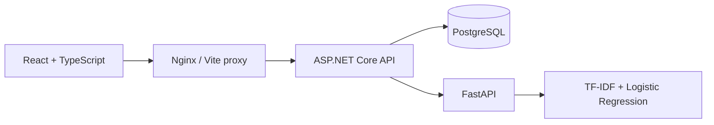

# Architecture

Spamira has one public application API. The React client sends requests to ASP.NET Core, which calls the internal FastAPI prediction service and persists successful member classifications in PostgreSQL. Guest message text and results are not saved.

## Request lifecycle

1. The analyzer validates a nonblank message of up to 5,000 characters.
2. The API validates CSRF and the session, repeats input validation, trims surrounding whitespace, reserves one daily guest slot when needed, and calls `/predict` through an injected `HttpClient` with a 10-second timeout.
3. FastAPI applies the preprocessing function embedded in the saved sklearn pipeline. `predict_proba` supplies both probabilities; the larger one determines the classification and confidence.
4. The API validates the prediction contract. Members receive `201 Created` after saving the result with their account ID. Guests receive `200 OK` without persistence. Failed inference refunds the reserved slot.
5. Dashboard and history require sign-in and filter by the current account ID on every query, including individual record lookups. Metrics are fetched from the active ML service, so the UI reflects its currently loaded model.

The client uses a 15-second request deadline and cancels obsolete GET requests during navigation or filtering. An analysis is not automatically retried: if a connection is lost after a save, inspect history before retrying to avoid duplicate records.

## Boundaries

- `Contracts`: request, response, and external-service DTOs.
- `Services`: classification orchestration and the HTTP adapter for prediction.
- `Data`: EF Core model, repository queries, and versioned migrations.
- `Infrastructure`: centralized safe error responses.
- `frontend/src/pages`: route-level pages, composed with shared layout and display components.
- `frontend/src/lib`: runtime API contract validation and cancellable resource loading.
- `ml-service/training`: dataset preparation, fitting, and independent evaluation.
- `ml-service/app`: model loading and HTTP inference.

## Persistence

`ClassificationResults` stores UUID, original trimmed message, label, confidence, both probabilities, UTC timestamp, ML processing duration, and model version, and nullable account ID. PostgreSQL constraints restrict labels and probability ranges. An account/date index supports private history queries; date and label/date indexes also remain. Search uses a parameterized, case-insensitive substring match; a trigram index can be introduced if message volume warrants it.

Creation timestamps use microsecond precision to match PostgreSQL, keeping the creation response identical to subsequent reads.

Docker Compose applies migrations at startup for a single API instance. For multiple instances, apply migrations as a deployment step and disable `Database__AutoMigrate`. The initial migration and snapshot are committed. Never edit a deployed migration; create a new one.

## Accounts and guest allowance

ASP.NET Core Identity stores salted password hashes and manages login lockout. HTTP-only SameSite=Lax cookies carry protected sessions; all API mutations validate CSRF tokens. Responses use Cache-Control: no-store. The client clears page state when accounts change and refreshes the session on window focus, authorization failure, and the guest reset time.

GuestQuotas keys combine the SHA-256 hash of the normalized IP and UTC date. Raw IPs and guest messages are not stored in this table. Atomic conditional SQL increments prevent concurrent requests from exceeding ten reservations; failed inference refunds its slot. NAT users share an allowance. This is an address-based quota, not a verified person count. Operators may remove old quota rows after their UTC day ends and in-flight requests finish.

The migration preserves previous unowned classifications, excluded from every account query. Database-level account deletion cascades to owned classifications. User-facing deletion, email verification, and password recovery are outside the current API.

## Failure behavior

| Condition | Behavior |
| --- | --- |
| Blank or oversized input | `400`, actionable validation message |
| Invalid query/filter/sort | `400` |
| ML timeout, unavailable service, malformed prediction | `503`, no classification saved |
| Database query/save failure | `503`, no successful save reported |
| Unknown or another account’s classification UUID | `404` |
| Guest requests history/statistics | `401` |
| Invalid or missing CSRF | `403` |
| Guest daily allowance exhausted | `429`, sign in or wait until 00:00 UTC |
| More than 60 analyses per minute per API-visible address | `429` |
| Unexpected application error | Safe `500` with trace ID; details in server logs |
| Missing model artifacts | ML health and prediction return `503` |

`/health` checks database connectivity and ML readiness. Frontend and ML containers also expose dedicated health checks. No user messages are deliberately written to application logs.

## Deployment scope

Compose binds exposed ports to loopback. Before public deployment, provide HTTPS, enable `AUTH_SECURE_COOKIES`, define retention, and arrange backups. Persist the restricted `auth-keys` volume alongside database backups; it protects session cookies and must be shared across API replicas. Local development uses the OS user profile key store unless `Auth__DataProtectionPath` is configured.

Nginx resolves the backend through Docker DNS with a five-second cache, so an API restart or container replacement can change its IP without requiring a frontend restart. Nginx overwrites forwarded IP and scheme headers. The API trusts its explicit internal address (`FRONTEND_INTERNAL_IP`, default `172.30.250.10`). Change `NETWORK_SUBNET` and that IP together if the subnet overlaps an existing network. Arbitrary remote senders cannot supply trusted client-IP headers. Vite forwarding is trusted through loopback.

If adding a TLS load balancer before Nginx, configure real-IP handling for only that balancer and preserve the original HTTPS scheme through the trusted chain. Otherwise the quota is shared under the balancer address. Keep direct backend and ML ports internal in a public deployment.

The frontend uses a same-origin `/api` proxy. Its API base is a build-time Vite setting. The bundled Nginx content policy permits same-origin API calls; an external API origin also requires an explicit policy and CORS update. Fonts are served by Google Fonts with local sans-serif fallbacks.

Model files are loaded through joblib and must come from a trusted training environment. Do not load user-uploaded artifacts. The ML service is internal to the application and needs no browser CORS configuration.
