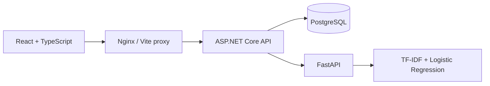

# Architecture

Spamira has one public application API. The React client sends requests to ASP.NET Core, which calls the internal FastAPI prediction service and persists successful classifications in PostgreSQL.

## Request lifecycle

1. The analyzer validates a nonblank message of up to 5,000 characters.
2. The API repeats validation, trims surrounding whitespace, and calls `/predict` through an injected `HttpClient` with a 10-second timeout.
3. FastAPI applies the preprocessing function embedded in the saved sklearn pipeline. `predict_proba` supplies both probabilities; the larger one determines the classification and confidence.
4. The API validates the prediction contract, stores the message and result using EF Core, and returns `201 Created` only after persistence succeeds.
5. Dashboard and history queries read the same persisted table. Metrics are fetched from the active ML service, so the UI reflects its currently loaded model.

The client uses a 15-second request deadline and cancels obsolete GET requests during navigation or filtering. An analysis is not automatically retried: if a connection is lost after a save, inspect history before retrying to avoid duplicate records.

## Boundaries

- `Contracts`: request, response, and external-service DTOs.
- `Services`: classification orchestration and the HTTP adapter for prediction.
- `Data`: EF Core model, repository queries, and versioned migrations.
- `Infrastructure`: centralized safe error responses.
- `frontend/src/pages`: route-level pages, composed with shared layout and display components.
- `frontend/src/lib`: runtime API contract validation and cancellable resource loading.
- `ml-service/training`: dataset preparation, fitting, and independent evaluation.
- `ml-service/app`: model loading and HTTP inference.

## Persistence

`ClassificationResults` stores UUID, original trimmed message, label, confidence, both probabilities, UTC timestamp, ML processing duration, and model version. PostgreSQL constraints restrict labels and probability ranges. Date and label/date indexes support history queries. Search uses a parameterized, case-insensitive substring match; a trigram index can be introduced if message volume warrants it.

Creation timestamps use microsecond precision to match PostgreSQL, keeping the creation response identical to subsequent reads.

Docker Compose applies migrations at startup for a single API instance. For multiple instances, apply migrations as a deployment step and disable `Database__AutoMigrate`. The initial migration and snapshot are committed. Never edit a deployed migration; create a new one.

## Failure behavior

| Condition | Behavior |
| --- | --- |
| Blank or oversized input | `400`, actionable validation message |
| Invalid query/filter/sort | `400` |
| ML timeout, unavailable service, malformed prediction | `503`, no classification saved |
| Database query/save failure | `503`, no successful save reported |
| Unknown classification UUID | `404` |
| More than 60 analyses per minute per API-visible address | `429` |
| Unexpected application error | Safe `500` with trace ID; details in server logs |
| Missing model artifacts | ML health and prediction return `503` |

`/health` checks database connectivity and ML readiness. Frontend and ML containers also expose dedicated health checks. No user messages are deliberately written to application logs.

## Deployment scope

This is a shared workspace without authentication. Compose binds exposed ports to loopback by default. Before exposing it publicly, provide HTTPS and access control at a trusted reverse proxy, define message-retention policy, and arrange database backups. Do not trust forwarded client-IP headers from arbitrary senders. With the provided Nginx proxy, API-visible rate limiting is shared across frontend users.

The frontend uses a same-origin `/api` proxy. Its API base is a build-time Vite setting. The bundled Nginx content policy permits same-origin API calls; an external API origin also requires an explicit policy and CORS update. Fonts are served by Google Fonts with local sans-serif fallbacks.

Model files are loaded through joblib and must come from a trusted training environment. Do not load user-uploaded artifacts. The ML service is internal to the application and needs no browser CORS configuration.
